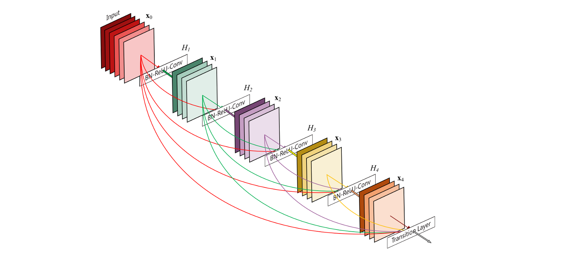

#**Traffic Sign Recognition with PyTorch** 

### Step By Step
* Load the data set (see below for links to the project data set)
* Explore, summarize and visualize the data set
* Design, train and test a model architecture
* Use the model to make predictions on new images
* Analyze the softmax probabilities of the new images
* Summarize the results with a written report

[//]: # (Image References)

[image1]: ./examples/visualization.jpg "Visualization"
[image2]: ./examples/grayscale.jpg "Grayscaling"
[image3]: ./examples/random_noise.jpg "Random Noise"
[image4]: ./images/452230479.jpg "Traffic Sign 1"
[image5]: ./images/2.jpg "Traffic Sign 2"
[image6]: ./images/3.jpg "Traffic Sign 3"
[image7]: ./images/4.jpg "Traffic Sign 4"
[image8]: ./images/5.jpg "Traffic Sign 5"
***********************

###Data Set Summary & Exploration

###1. I used the pandas library to calculate summary statistics of the traffic

- Number of training examples = 34799
- Number of testing examples = 12630
- Image data shape = (32, 32, 3)
- Number of classes = 43

####2. Include an exploratory visualization of the dataset.

Let's see the distribution of class in training-set , validation-set:

It seems that all dataset inclued training, validation, test, have the same distribution. It was great?  Let's do something nicer.

### 3. Show the probabilty for each classes of all dataset

- It seems that targets is unbalance
- It seems that within the middle of the chart, something different between training-set. validation-set and test-set. Should we do something helpful likes [resample](https://en.wikipedia.org/wiki/Resampling). (I do many experiment. And it shows that the technology of resample is useless... )

###Design and Test a Model Architecture

####1. Preprocessed & Data Augmentation

**As a first step** I normalized the image data because
- Training the network more faster
- Traing the network more eaier
- Ignoring the death of activation

**As a second step**, I decided to convert the images to grayscale because 
- It can get the higher score :smile:

Here is an example of a traffic sign image before and after grayscaling.

![alt text][image2]

As a last step, I do a list of data augmentation:
- Randomly, choosing 20% data to rotate the images with 30 degree
- Randomly, choosing 10% data to Zoom the images 
- Randomly, choosing 10% data to shift the images
 

####2. My model

**I use [DenseNet121](https://arxiv.org/pdf/1608.06993.pdf)** which is the popular network architecture.
 

####3. Training DenseNet

**Attention**: I retrain DenseNet model from scratch.

To train the model, I used this parameters:
- **epoch: 30**
- **batch_size: 128**
- **lr: 0.001**
- **lr_decay_step: 0.1/10** Learning rate narrow 0.1 / 10 epoch

And then, I use **Adam** to optimizer my loss which is calculated by **SoftmaxCrossEntropy**.

####4. Accuracy fro Traing, Validation, Testing

My final model results were:
* training set accuracy of 0.9999
* validation set accuracy of 0.9588
* test set accuracy of 0.9482

If a well known architecture was chosen:
* I choose DenseNet model
* It was used to training image in ImageNet Challenge, So I think there is no problem to use DenseNet model for traffic sign classification.

 

###Test a Model on New Images

####1. Choose five German traffic signs found on the web 

Here are five German traffic signs that I found on the web:

The first image might be difficult to classify because the background is so large.

####2. Discuss the model's predictions 
Here are the results of the prediction:

The model was very state-of-art

####3. Describe how certain the model is when predicting on each of the five new images by looking at the softmax probabilities for each prediction. 

### (Optional) Visualizing the Neural Network (See Step 4 of the Ipython notebook for more details)
####1. Discuss the visual output of your trained network's feature maps. What characteristics did the neural network use to make classifications?

